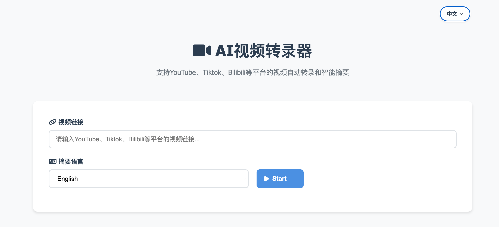

<div align="center">

# AI视频转录器

中文 | [English](README.md)

一款开源的AI视频转录和摘要工具，支持YouTube、Bilibili、抖音等30+平台。



</div>

## ✨ 功能特性

- 🎥 **多平台支持**: 支持YouTube、Bilibili、抖音等30+平台。
- 🗣️ **智能转录**: 使用Faster-Whisper模型进行高精度语音转文字
- 🤖 **AI文本优化**: 自动错别字修正、句子完整化和智能分段
- 🌍 **多语言摘要**: 支持多种语言的智能摘要生成
- ⚙️ **条件式翻译**：当所选总结语言与Whisper检测到的语言不一致时，自动调用GPT‑4o生成翻译
- 📱 **移动适配**: 完美支持移动设备

## 🚀 快速开始

### 环境要求

- Python 3.8+
- FFmpeg
- 可选：OpenAI API密钥（用于智能摘要功能）

### 安装方法


#### 方法一：自动安装

```bash
# 克隆项目
git clone https://github.com/wendy7756/AI-Video-Transcriber.git
cd AI-Video-Transcriber

# 运行安装脚本
chmod +x install.sh
./install.sh
```

#### 方法二：Docker部署

```bash
# 克隆项目
git clone https://github.com/wendy7756/AI-Video-Transcriber.git
cd AI-Video-Transcriber

# 使用Docker Compose（最简单）
cp .env.example .env
# 编辑.env文件，设置你的OPENAI_API_KEY
docker-compose up -d

# 或者直接使用Docker
docker build -t ai-video-transcriber .
docker run -p 8000:8000 -e OPENAI_API_KEY="你的API密钥" ai-video-transcriber
```

#### 方法三：手动安装

1. **安装Python依赖**（建议使用虚拟环境）
```bash
# 创建并启用虚拟环境（macOS推荐，避免 PEP 668 系统限制）
python3 -m venv .venv
source .venv/bin/activate
python -m pip install --upgrade pip
pip install -r requirements.txt
```

2. **安装FFmpeg**
```bash
# macOS
brew install ffmpeg

# Ubuntu/Debian
sudo apt update && sudo apt install ffmpeg

# CentOS/RHEL
sudo yum install ffmpeg
```

3. **配置环境变量**（摘要/翻译功能需要）
```bash
# 必需：启用智能摘要/翻译
export OPENAI_API_KEY="你的_API_Key"

# 可选：如使用自建/代理的OpenAI兼容网关，按需设置
```

### 启动服务

```bash
python3 start.py
```

服务启动后，打开浏览器访问 `http://localhost:8000`

#### 使用显式环境变量启动（示例）

```bash
source .venv/bin/activate
export OPENAI_API_KEY=你的_API_Key
# export OPENAI_BASE_URL=https://oneapi.basevec.com/v1  # 如使用自定义端点
python3 start.py --prod
```

## 📖 使用指南

1. **输入视频链接**: 在输入框中粘贴YouTube、Bilibili等平台的视频链接
2. **选择摘要语言**: 选择希望生成摘要的语言
3. **开始处理**: 点击"开始"按钮
4. **监控进度**: 观察实时处理进度，包含多个阶段：
   - 视频下载和解析
   - 使用Faster-Whisper进行音频转录
   - AI智能转录优化（错别字修正、句子完整化、智能分段）
   - 生成选定语言的AI摘要
5. **查看结果**: 查看优化后的转录文本和智能摘要
6. **下载文件**: 点击下载按钮保存Markdown格式的文件

## 🛠️ 技术架构

### 后端技术栈
- **FastAPI**: 现代化的Python Web框架
- **yt-dlp**: 视频下载和处理
- **Faster-Whisper**: 高效的语音转录
- **OpenAI API**: 智能文本摘要

### 前端技术栈
- **HTML5 + CSS3**: 响应式界面设计
- **JavaScript (ES6+)**: 现代化的前端交互
- **Marked.js**: Markdown渲染
- **Font Awesome**: 图标库

### 项目结构
```
AI-Video-Transcriber/
├── backend/                 # 后端代码
│   ├── main.py             # FastAPI主应用
│   ├── video_processor.py  # 视频处理模块
│   ├── transcriber.py      # 转录模块
│   ├── summarizer.py       # 摘要模块
│   └── translator.py       # 翻译模块
├── static/                 # 前端文件
│   ├── index.html          # 主页面
│   └── app.js              # 前端逻辑
├── temp/                   # 临时文件目录
├── Docker相关文件           # Docker部署
│   ├── Dockerfile          # Docker镜像配置
│   ├── docker-compose.yml  # Docker Compose配置
│   └── .dockerignore       # Docker忽略规则
├── .env.example        # 环境变量模板
├── requirements.txt    # Python依赖
└── start.py           # 启动脚本

```

## ⚙️ 配置选项

### 环境变量

| 变量名 | 描述 | 默认值 | 必需 |
|--------|------|--------|------|
| `OPENAI_API_KEY` | OpenAI API密钥 | - | 否 |
| `HOST` | 服务器地址 | `0.0.0.0` | 否 |
| `PORT` | 服务器端口 | `8000` | 否 |
| `WHISPER_MODEL_SIZE` | Whisper模型大小 | `base` | 否 |

### 本地/私有 LLM 使用说明（可选）

项目支持将摘要与翻译请求转发到本地或私有的 LLM HTTP 服务（例如在 Docker 中运行的 llama 服务或 TGI）。如果不想使用 OpenAI 公共 API，可按下列步骤配置：

- 启动你的本地 LLM 服务（示例：Docker 容器在本机的 8080 端口暴露 OpenAI-compatible 的 /v1/chat/completions 接口，模型已加载）。
- 在项目运行环境设置以下环境变量：
  - `LOCAL_LLM_API_URL`：本地服务地址，例如 `http://localhost:8080`
  - `LOCAL_LLM_MODEL_NAME`：服务中注册的模型 id（可选，根据服务而定）

示例（PowerShell）：
```powershell
$env:LOCAL_LLM_API_URL = 'http://localhost:8080'
$env:LOCAL_LLM_MODEL_NAME = 'Qwen3-8B-gpt-5-reasoning-distill-Q4_K_M'
python start.py
```

注意：
- 本仓库实现了一个简易的 HTTP 适配器 `backend/llm_adapters.py`，会尝试调用 `/v1/chat/completions`、`/v1/models/{model}/chat/completions` 或 `/generate` 端点以兼容不同服务。
- 你不需要把本地的 gguf 文件路径传入代码，Docker 容器在启动时已负责加载模型文件；代码只需调用服务的 HTTP API。
- 如你的服务使用非兼容接口（自定义 JSON），需根据返回格式调整 `backend/llm_adapters.py`。 

### Whisper模型大小选项

| 模型 | 参数量 | 英语专用 | 多语言 | 速度 | 内存占用 |
|------|--------|----------|--------|------|----------|
| tiny | 39 M | ✓ | ✓ | 快 | 低 |
| base | 74 M | ✓ | ✓ | 中 | 低 |
| small | 244 M | ✓ | ✓ | 中 | 中 |
| medium | 769 M | ✓ | ✓ | 慢 | 中 |
| large | 1550 M | ✗ | ✓ | 很慢 | 高 |

## 🔧 常见问题

### Q: 为什么转录速度很慢？
A: 转录速度取决于视频长度、Whisper模型大小和硬件性能。可以尝试使用更小的模型（如tiny或base）来提高速度。

### Q: 支持哪些视频平台？
A: 支持所有yt-dlp支持的平台，包括但不限于：YouTube、抖音、Bilibili、优酷、爱奇艺、腾讯视频等。

### Q: AI优化功能不可用怎么办？
A: 转录优化和摘要生成都需要OpenAI API密钥。如果未配置，系统会提供Whisper的原始转录和简化版摘要。

### Q: 出现 500 报错/白屏，是代码问题吗？
A: 多数情况下是环境配置问题，请按以下清单排查：
- 是否已激活虚拟环境：`source .venv/bin/activate`
- 依赖是否安装在虚拟环境中：`pip install -r requirements.txt`
- 是否设置 `OPENAI_API_KEY`（启用摘要/翻译所必需）
- 如使用自定义网关，`OPENAI_BASE_URL` 是否正确、网络可达
- 是否已安装 FFmpeg：macOS `brew install ffmpeg` / Debian/Ubuntu `sudo apt install ffmpeg`
- 8000 端口是否被占用；如被占用请关闭旧进程或更换端口

### Q: 如何处理长视频？
A: 系统可以处理任意长度的视频，但处理时间会相应增加。建议对于超长视频使用较小的Whisper模型。

### Q: 如何使用Docker部署？
A: Docker提供了最简单的部署方式：

**前置条件：**
- 从 https://www.docker.com/products/docker-desktop/ 安装Docker Desktop
- 确保Docker服务正在运行

**快速开始：**
```bash
# 克隆和配置
git clone https://github.com/wendy7756/AI-Video-Transcriber.git
cd AI-Video-Transcriber
cp .env.example .env
# 编辑.env文件设置你的OPENAI_API_KEY

# 使用Docker Compose启动（推荐）
docker-compose up -d

# 或手动构建运行
docker build -t ai-video-transcriber .
docker run -p 8000:8000 --env-file .env ai-video-transcriber
```

### 针对需要 cookies 的平台（例如抖音）的说明

某些站点（尤其是抖音/抖音短视频）在使用 `yt-dlp` 下载时可能需要新鲜的浏览器 cookies。你可以将浏览器 cookies 导出为 Netscape `cookies.txt` 格式，并通过 `YTDLP_COOKIEFILE` 环境变量提供给应用。

示例：

本地运行（Linux/macOS）：
```bash
export YTDLP_COOKIEFILE=/path/to/cookies.txt
python3 start.py
```

Windows PowerShell：
```powershell
$env:YTDLP_COOKIEFILE = 'C:\path\to\cookies.txt'
python start.py
```

Docker（将本地 cookies 文件挂载到容器）：
```bash
# 将本地 cookies.txt 挂载到容器的 /app/cookies.txt，并设置 YTDLP_COOKIEFILE 指向它
docker run -p 8000:8000 -v /local/path/cookies.txt:/app/cookies.txt -e YTDLP_COOKIEFILE=/app/cookies.txt --env-file .env ai-video-transcriber
```

注意：
- cookies 文件应为 Netscape 格式（多数浏览器导出扩展支持该格式）。
- 如果设置了 `YTDLP_COOKIEFILE`，服务器在获取视频信息与下载时会将该 cookie 文件传递给 `yt-dlp`。

**常见Docker问题：**
- **端口冲突**：如果8000端口被占用，可改用 `-p 8001:8000`
- **权限拒绝**：确保Docker Desktop正在运行且有适当权限
- **构建失败**：检查磁盘空间（需要约2GB空闲空间）和网络连接
- **容器无法启动**：验证.env文件存在且包含有效的OPENAI_API_KEY

**Docker常用命令：**
```bash
# 查看运行中的容器
docker ps

# 检查容器日志
docker logs ai-video-transcriber-ai-video-transcriber-1

# 停止服务
docker-compose down

# 修改后重新构建
docker-compose build --no-cache
```

### Q: 内存需求是多少？
A: 内存使用量根据部署方式和工作负载而有所不同：

**Docker部署：**
- **基础内存**：空闲容器约128MB
- **处理过程中**：根据视频长度和Whisper模型，需要500MB - 2GB
- **Docker镜像大小**：约1.6GB磁盘空间
- **推荐配置**：4GB+内存以确保流畅运行

**传统部署：**
- **基础内存**：FastAPI服务器约50-100MB
- **Whisper模型内存占用**：
  - `tiny`：约150MB
  - `base`：约250MB
  - `small`：约750MB
  - `medium`：约1.5GB
  - `large`：约3GB
- **峰值使用**：基础 + 模型 + 视频处理（额外约500MB）

**内存优化建议：**
```bash
# 使用更小的Whisper模型减少内存占用
WHISPER_MODEL_SIZE=tiny  # 或 base

# Docker部署时可限制容器内存
docker run -m 1g -p 8000:8000 --env-file .env ai-video-transcriber

# 监控内存使用情况
docker stats ai-video-transcriber-ai-video-transcriber-1
```

### Q: 网络连接错误或超时怎么办？
A: 如果在视频下载或API调用过程中遇到网络相关错误，请尝试以下解决方案：

**常见网络问题：**
- 视频下载失败，出现"无法提取"或超时错误
- OpenAI API调用返回连接超时或DNS解析失败
- Docker镜像拉取失败或极其缓慢

**解决方案：**
1. **切换VPN/代理**：尝试连接到不同的VPN服务器或更换代理设置
2. **检查网络稳定性**：确保你的网络连接稳定
3. **更换网络后重试**：更改网络设置后等待30-60秒再重试
4. **使用备用端点**：如果使用自定义OpenAI端点，验证它们在你的网络环境下可访问
5. **Docker网络问题**：如果容器网络失败，重启Docker Desktop

**快速网络测试：**
```bash
# 测试视频平台访问
curl -I https://www.youtube.com/

# 测试OpenAI API访问（替换为你的端点）
curl -I https://api.openai.com

# 测试Docker Hub访问
docker pull hello-world
```

如果问题持续存在，尝试切换到不同的网络或VPN位置。

## 🤝 贡献指南

欢迎提交Issue和Pull Request！

1. Fork项目
2. 创建功能分支 (`git checkout -b feature/AmazingFeature`)
3. 提交更改 (`git commit -m 'Add some AmazingFeature'`)
4. 推送到分支 (`git push origin feature/AmazingFeature`)
5. 开启Pull Request 

## 致谢

- [yt-dlp](https://github.com/yt-dlp/yt-dlp) - 强大的视频下载工具
- [Faster-Whisper](https://github.com/guillaumekln/faster-whisper) - 高效的Whisper实现
- [FastAPI](https://fastapi.tiangolo.com/) - 现代化的Python Web框架
- [OpenAI](https://openai.com/) - 智能文本处理API

## 📞 联系方式

如有问题或建议，请提交Issue或联系Wendy。
